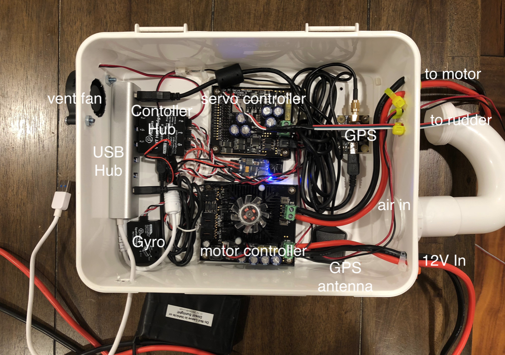
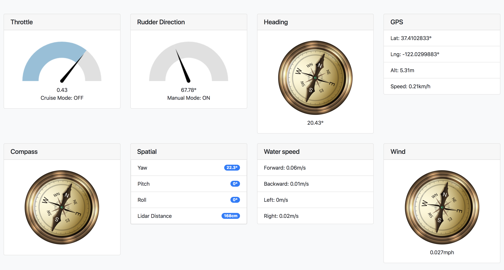

# DeepNav_Control_System

DeepNav Control System is a python based autonomous boat control system. It connects to different control command sources, variety of sensors, and gauge cluster. It's the orchestrator of core driving information.
In this system, we mostly uses components from [Phidgets](https://www.phidgets.com/) as physical layer to directly operate these heavy lifting metals.

***Above is a work-in-progress control box***

## Core Components

### Manual Controller

In manual mode, we use xbox one or ps4 game controller connected via wire to control the throttle and steering, also we mapped buttons to switch between manual mode and AI mode, toggle of cruise mode and drive/revers shifter.

### Device Manager

Device Manager is the heart of this control system, it manages all devices and mediates states and events from different devices.

### WsServer

WsServer is a websocket server which smartly pushes system state and changes to any client which listens and processes/learns from the behavior of the boat.

"Smartly" here means: it minimizes the data pushed to client, when there are rapid state changes, data will be pushed more frequently, and only the delta of the state (A.K.A Event) is pushed; When the system stays still for long enough, it syncs all the clients with the overall state of system, so that all clients can stay on the same page if some missed some frames of data.

### Drivers/Sensors

In order to drive a boat, basically, we need to drive the propeller, we need to turn the rudder.

In order to let computer drive a boat, not only we need to give it the ability to control the propeller and rudder, we also need to let it "feel/sense" the state of its surroundings. In our case, we give the following senses to it:

#### Propeller and rudder driver

Since propeller is connected to a 12VDC motor, we use "[DC Motor Phidget](https://www.phidgets.com/?tier=3&catid=18&pcid=15&prodid=965)" to control it which works with 20A of current max.
Rudder is connected to a [powerful servo](https://www.ebay.com/itm/ASMC-04B-Large-torque-alloy-steering-gear-12V-24V-180kg-cm-Large-robot-arm/302426072650?ssPageName=STRK%3AMEBIDX%3AIT&_trksid=p2060353.m2749.l2649), so we use [16x RC Servo Phidget](https://www.phidgets.com/?tier=3&catid=21&pcid=18&prodid=1015)
to operate it.

#### Location Data

GPS module is used to find out where we exactly it is, how faster is it traveling relative to ground and where is it heading.
We use [PhidgetGPS](https://www.phidgets.com/?tier=3&catid=10&pcid=8&prodid=1031).

#### Spatial Data

Posture data of the boat is useful when computer want to know how bumpy is the water, how fast is the boat is turning, etc.
We use [Spatial Phidget](https://www.phidgets.com/?tier=3&catid=10&pcid=8&prodid=975) in our setup.

#### Water speed

Driving a boat is different from driving a car, because the road doesn't move, but water does all the time. We can measure the effectiveness of proposing from GPS data, but we have no idea how fast the propeller is pushing the boat forward. That's where we need to have a water flow meter to see how fast we are traveling relative to the water flow under the boat.

We use [water flow sensor](https://www.robotshop.com/en/seeedstudio-water-flow-sensor.html) to hook to the [Versatile Input Phidget](https://www.phidgets.com/?tier=3&catid=49&pcid=42&prodid=961)'s FrequencyCounter to get speed of flow. We have 4 of such sensors to measure the water speed in 4 directions: forward, backward, left and right.
In order to just measure the direction we desire, we mount a L shape pipe to the exit end of the sensor, so that when going other directions, no significant flow is forced to pass the sensor.

#### Wind speed and direction

Wind plays an important role while driving a boat, so we hooked the [Weather Meters](https://www.sparkfun.com/products/8942) to the system via 2 [Versatile Input Phidgets](https://www.phidgets.com/?tier=3&catid=49&pcid=42&prodid=961) to get the speed and direction of the wind.

#### Collision prevention

This one is obvious, we use the weather sealed [LIDAR-Lite v3HP](https://www.sparkfun.com/products/14599) from Garmin™ to find out how close we are to anything else from us. This little pair of glasses have a range of 5cm to 40m, which is pretty neat for our case.

#### Vision

To be added

## FAQ

### Where is the gauge cluster

Good question, someone on the boat would definitely like to know what is going on in the boat who has its own ideas. That's why we created the gauge cluster as a client of control system's web socket. It's in it's own repo https://github.com/DeepNav/Dashboard

### Where is the autonomous driving code

It's a different problem we are trying to solve in this repo. We'll release more detail soon.